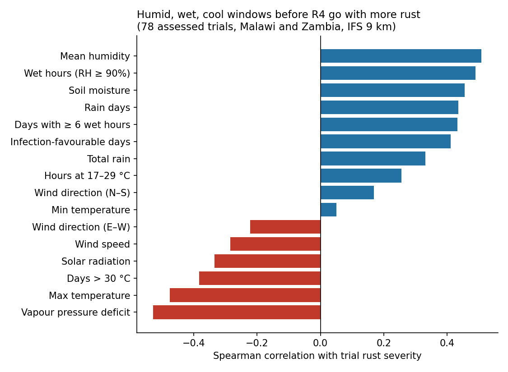
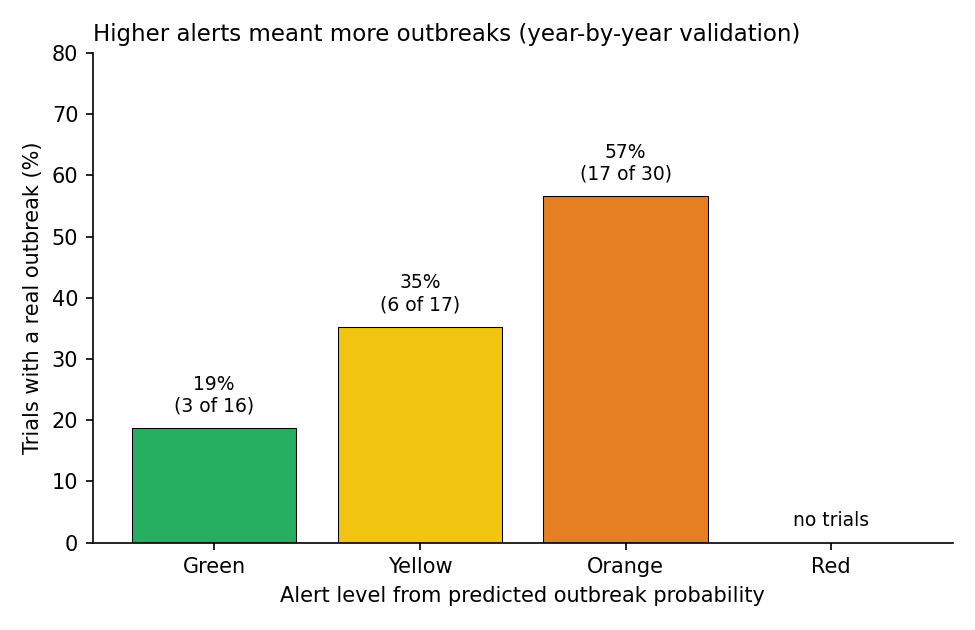
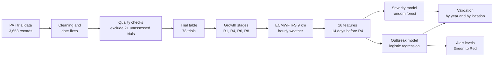
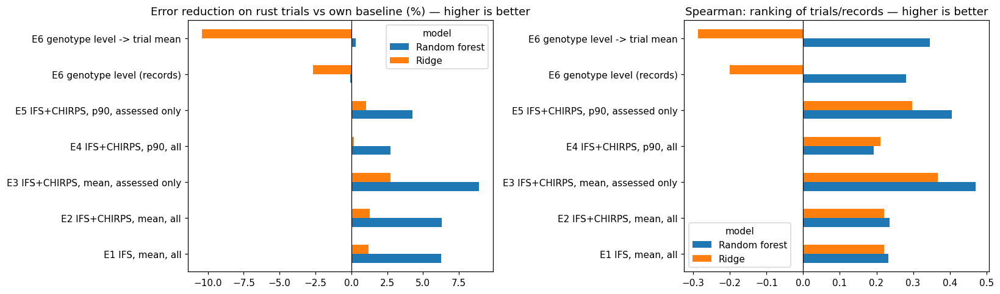

# Soybean Rust Early Warning for Malawi and Zambia

A weather-driven early warning model for **soybean rust** (*Phakopsora pachyrhizi*), built from Pan-African Soybean Variety Trial (PAT) data and hourly ECMWF weather. The model predicts rust severity and the probability of an outbreak from the weather in the 14 days before the crop reaches growth stage R4 (full pod).

> **Status:** research in progress (September 2026). Results below are from year-by-year validation on 78 trials; the model is a validated baseline, not yet an operational warning system.

**Author:** Jovin Njau

---

## Key results

| Model | Measure | Result |
|---|---|---|
| Severity (random forest) | Error reduction vs no-weather baseline, on trials with rust | **9.2%** |
| Severity (random forest) | Spearman correlation, predicted vs observed | **0.47** |
| Outbreak (logistic regression) | Outbreaks caught (recall) | **15 of 26 (58%)** |
| Outbreak (logistic regression) | Alarms that were real (precision) | **54%** |
| Outbreak (logistic regression) | AUC | **0.65** |

These results come from **year-by-year validation**: for each test year, the model is trained only on earlier years and then predicts that year (2019–2024), mirroring how a warning system would be used.

**The model also works at locations it has never seen.** Holding out whole 50 km areas, it still caught 26 of 34 outbreaks (AUC 0.65), which supports mapping rust risk beyond the trial sites:

| Validation | Held out each round | Spearman | Outbreaks caught | Precision | AUC |
|---|---|---|---|---|---|
| Year-by-year | One future year | 0.47 | 15 of 26 | 0.54 | 0.65 |
| Leave-location-out | One of 38 locations | 0.45 | 25 of 34 | 0.62 | 0.66 |
| Leave-block-out | All locations within a 50 km cluster (17 clusters) | 0.36 | 26 of 34 | 0.63 | 0.65 |

**Weather signal.** Rust was more severe after humid, wet and cool windows, and less severe after hot, dry ones:



**Alerts.** Converting the outbreak probability into four alert levels gives correctly ordered risk: 20% of Green trials, 40% of Yellow and 54% of Orange trials had real outbreaks.



---

## Pipeline



## Methods in brief

- **Data.** PAT multi-environment trials, 2017–2024: 99 trials in Malawi (66) and Zambia (33), 174 genotypes. Rust severity was scored at R6 on a 1–5 scale (1 = no symptoms, 5 = over 66% of leaf area affected).
- **Target.** Trial mean severity (1–5), and outbreak = at least one genotype scored 3 or more.
- **Quality control.** Trials where every genotype scored 0 and no other disease was recorded were treated as probably not assessed and excluded (21 trials). Date errors were corrected automatically and listed (see [docs/data_issues.md](docs/data_issues.md)).
- **Growth stages.** R4 and R6 were placed between each trial's own flowering (R1) and maturity (R8) dates using the relative positions of the Manitoba Soybean Plant Development Guide: R4 = R1 + 0.33 × (R8 − R1). Estimated maturity came a median of 26 days before the recorded harvest, supporting these estimates.
- **Weather.** Hourly ECMWF IFS (9 km) data from the Open-Meteo Historical Weather API, at each trial's coordinates.
- **Features.** 16 epidemiological variables over the 14 days before R4, including leaf-wetness hours (RH ≥ 90%), infection-favourable days (≥ 6 wet hours at 17–29 °C), minimum and maximum temperature, rainfall, vapour pressure deficit, solar radiation, wind and soil moisture.

Full details: [docs/methods.md](docs/methods.md).

## What was tested (and what did not help)

| Experiment | Outcome | Notebook |
|---|---|---|
| Weather source: ERA5 (25 km) vs ERA5-Land (11 km) vs ECMWF IFS (9 km) | IFS best with every model; ERA5 put 90 sites into only 38 grid cells | [exp1](notebooks/experiments/exp1_weather_source_comparison.ipynb) |
| CHIRPS rainfall (5 km) instead of IFS rain | No improvement (6.3% vs 6.3%) | [exp2](notebooks/experiments/exp2_model_improvements.ipynb) |
| Excluding probably-unassessed trials | **Largest improvement**: Spearman 0.24 → 0.47 | [exp2](notebooks/experiments/exp2_model_improvements.ipynb) |
| p90 severity (most susceptible genotypes) instead of mean | Weaker than the mean | [exp2](notebooks/experiments/exp2_model_improvements.ipynb) |
| Genotype-level model with genotype susceptibility | No improvement at trial level | [exp2](notebooks/experiments/exp2_model_improvements.ipynb) |
| Weather window before R6 instead of R4 | Similar accuracy; R4 caught more outbreaks and warns ~17 days earlier | [results](results/experiments/exp3_R4_vs_R6_window.csv) |
| Spore-source proxies from earlier trials (same location, within 25 km, same country, Malawi vs Zambia) | No consistent improvement; trial history too sparse (half of locations used once) | [results](results/experiments/exp4_spore_source_proxies.csv) |
| Spatial validation (leave-location-out, 50 km blocks) | Outbreak detection holds at unseen locations | [results](results/experiments/exp5_spatial_validation.csv) |



## Repository structure

```
notebooks/
  01_main_pipeline.ipynb                    main pipeline (run end to end in Google Colab)
  experiments/
    exp1_weather_source_comparison.ipynb    ERA5 vs ERA5-Land vs IFS vs CHIRPS
    exp2_model_improvements.ipynb           CHIRPS, trial exclusion, p90, genotype level, outbreak model
results/
  main/                                     trial features, predictions and alerts from the main pipeline
  experiments/                              result tables of the experiments, all weather features
figures/                                    figures used in this README
docs/
  methods.md                                detailed methods
  data_issues.md                            data-quality findings for the data team
data/
  README.md                                 how to obtain the trial data (not included)
```

## How to run

1. Open `notebooks/01_main_pipeline.ipynb` in [Google Colab](https://colab.research.google.com/) (File → Upload notebook, or open from GitHub).
2. Choose **Runtime → Run all** and upload the PAT trial CSV when asked (see [data/README.md](data/README.md)).
3. All decisions (study area, trial exclusions, growth stage, thresholds) are in the settings cell at the top.

Weather is downloaded automatically from the Open-Meteo API (no account needed). To run locally: `pip install -r requirements.txt`.

## Limitations

- About 80 usable trials, most with little rust; differences of a few percent can be chance.
- Leaf wetness is estimated from humidity, and R4/R6 dates are estimated rather than observed.
- Weather alone does not explain rust in several Zambian trials with ideal conditions but no recorded rust, which suggests a role for spore availability; proxies built from trial history were too sparse to capture it.
- The exclusion of unassessed trials is pending confirmation from the trial pathologists.

## Next steps

- [x] Clean, reproducible pipeline with data-quality checks
- [x] Weather source, target and time-window comparisons
- [x] Validation at unseen locations
- [ ] Spore pressure from rust surveillance data (spore proxies from trial history did not help)
- [ ] Rust-risk maps for Malawi and Zambia on a 9 km grid, with sowing dates from season onset
- [ ] Forecast layer driven by ECMWF weather forecasts

## Data sources and acknowledgements

- Trial data: Pan-African Soybean Variety Trials (PAT), Feed the Future Soybean Innovation Lab and partners. The data are not redistributed here.
- Weather: ECMWF IFS and ERA5 via the [Open-Meteo](https://open-meteo.com/) Historical Weather API; CHIRPS rainfall from the Climate Hazards Center, UC Santa Barbara.

## References

- Araújo, M. S. et al. (2025). High-resolution soybean trial data supporting the expansion of agriculture in Africa. *Scientific Data* 12, 1908. https://doi.org/10.1038/s41597-025-06190-3
- Favoretto, V. R., Murithi, H. M. et al. (2025). Soybean rust-resistant and tolerant varieties identified through the Pan-African Trial Network. *Pest Management Science* 81, 2769–2775. https://doi.org/10.1002/ps.8639
- Melching, J. S., Dowler, W. M., Koogle, D. L. & Royer, M. H. (1989). Effects of duration, frequency, and temperature of leaf wetness periods on soybean rust. *Plant Disease* 73, 117–122.
- Del Ponte, E. M., Godoy, C. V., Li, X. & Yang, X. B. (2006). Predicting severity of Asian soybean rust epidemics with empirical rainfall models. *Phytopathology* 96, 797–803.
- Funk, C. et al. (2015). The climate hazards infrared precipitation with stations — a new environmental record for monitoring extremes. *Scientific Data* 2, 150066.

## License

Code in this repository is released under the MIT License (see [LICENSE](LICENSE)). Trial data remain the property of their owners.
